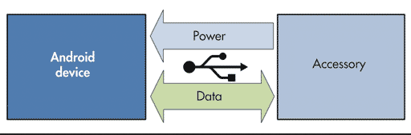
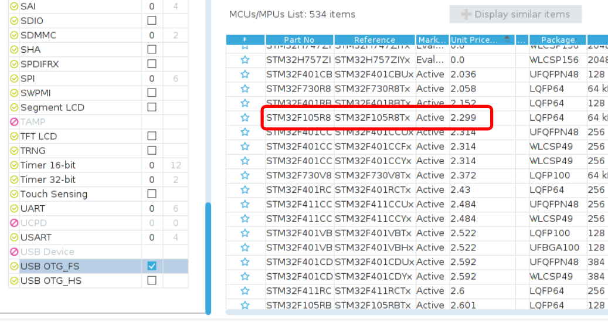
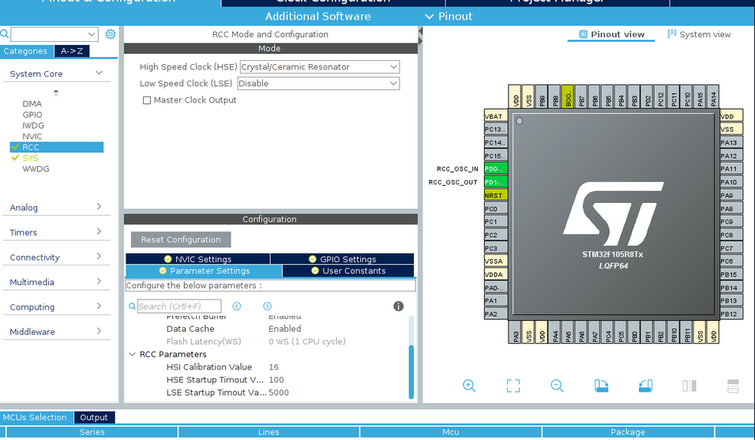
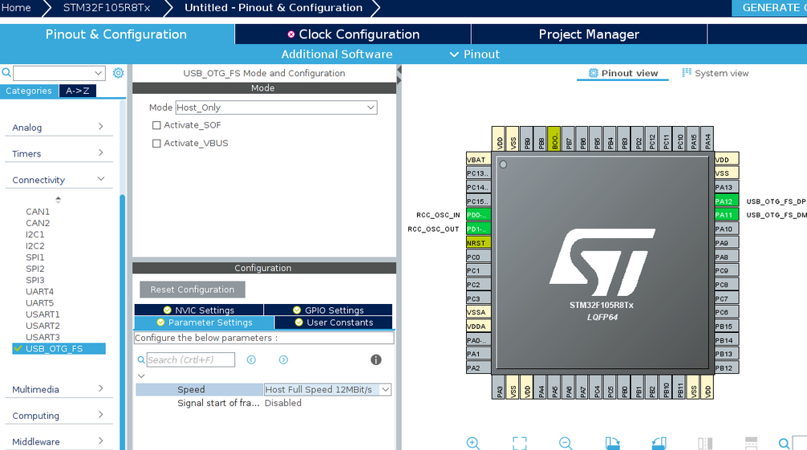
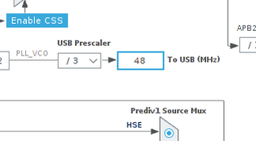
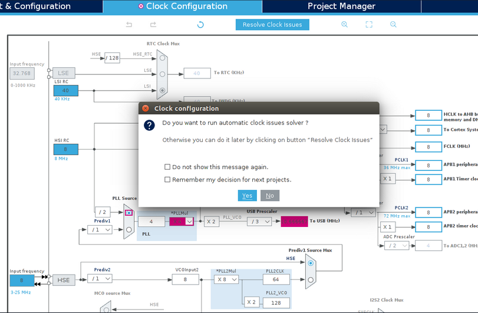
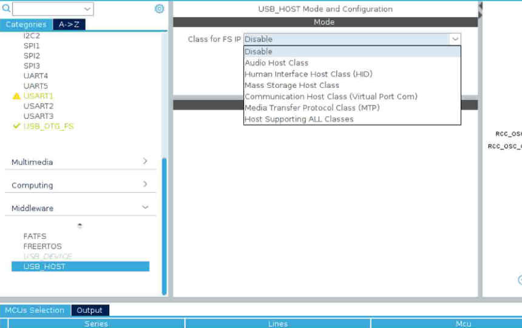
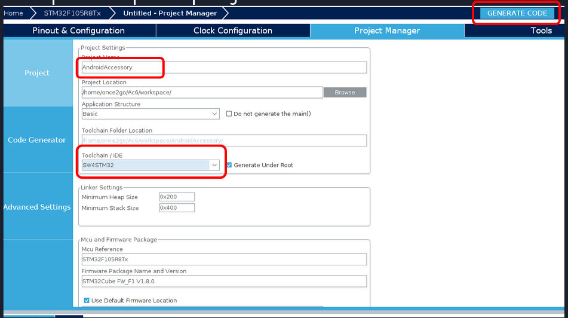

# Stm32-Android-Accessory
Stm32 USB HAL Class and configuration for Android Accessory Mode

## Android Open Accessory (AOA)
[Android Open Accessory (AOA)](https://source.android.com/devices/accessories/protocol) support allows external USB hardware (Android USB accessories) to interact with Android-powered devices in accessory mode. When an Android-powered powered device is in accessory mode, the connected accessory acts as the USB host (powers the bus and enumerates devices) and the Android-powered device acts as the USB accessory...




'AndroidAccessoryUSBClass' should be used with Stm32 USB Core HAL components. 

##Setup procedure: 
#### Step 1. Choose MCU in STM32CubeMX
[STM32CubeMX](https://www.st.com/en/development-tools/stm32cubemx.html) is a graphical tool that allows a very easy configuration of STM32 microcontrollers and microprocessors, as well as the generation of the corresponding initialization C code for the Arm® Cortex®-M core or a partial Linux® Device Tree for Arm® Cortex®-A core), through a step-by-step process. 



#### Step 2. Enable crystal/clock resonator



#### Step 3. Enable USB Host



#### Step 4. Setup clock configuration
USB require 48MHz frequency



or use automatic issue solver 



#### Step 5. Add random USB Class


#### Step 6. Generate project for your favorite IDE

My preference is SW4STM32. Its Eclipse based IDE and works on Windows, Linux & osX

#### Step 7. Add AndroidAccessory.[h/c] & AndroidAccessoryUSBClass.[h/c] to Src directory and configure:
In usb_host.c add: 

```c
/* USER CODE BEGIN Includes */

#include "AndroidAccessory.h"
#include "AndroidAccessoryUSBClass.h"

/* USER CODE END Includes */
```

```c
/* USER CODE BEGIN 1 */
void  MX_USBH_AA_Process(void) {
	if (!Is_AA_Connected() && hUsbHostFS.gState >= HOST_CHECK_CLASS
			&& hUsbHostFS.gState < HOST_AA_CHECK_COMPATIBILITY) {
		hUsbHostFS.gState = HOST_AA_CHECK_COMPATIBILITY;
	}
	USBH_AA_Process(&hUsbHostFS);
}
/* USER CODE END 1 */
```

Then find 'MX_USB_HOST_Init' function and insert: 
```c
  /* USER CODE BEGIN USB_HOST_Init_PreTreatment */
	AndroidAccessory("manufacture_name", "model_name", "description", "1.0", "uri", "serial", 0);
  /* USER CODE END USB_HOST_Init_PreTreatment */
 
  /* USER CODE BEGIN USB_HOST_Init_PostTreatment */
	if ( USBH_RegisterClass(&hUsbHostFS, USBH_AA_CLASS) != USBH_OK)
	{
		Error_Handler();
	}
  /* USER CODE END USB_HOST_Init_PostTreatment */
```


In main.c:
```c
  while (1)
  {
    /* USER CODE END WHILE */
    MX_USB_HOST_Process();

    /* USER CODE BEGIN 3 */
    MX_USBH_AA_Process();
  }
```

Assign your incoming data callback:

```c
/*
 * Data read call back
 */
void (*usbDataReceivedCallback)(uint8_t*, int);
```
and 'accesoryWriteUSBDataFromRxTxBuffer' function for output transmission
 
## UPD:Nov25, 19
Latest HAL for Stm32F1xx will generate code with missed callback for port reset listener. Temp. fix:
 - in file usbh_conf.c add: 
```c
/* USER CODE BEGIN 1 */
void HAL_HCD_PortEnabled_Callback(HCD_HandleTypeDef *hhcd)
{
  USBH_LL_PortEnabled(hhcd->pData);
}
/* USER CODE END 1 */
```
 - add USBH_AA_CLASS class registration before USBH_Start call.
 

